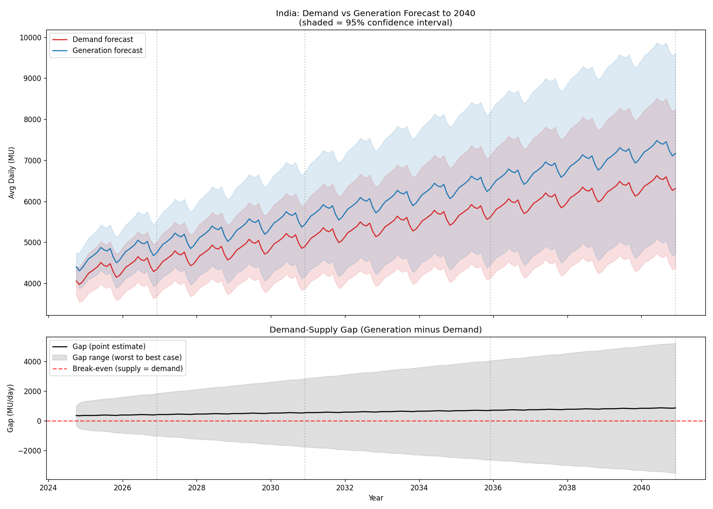

# India Electricity Demand, Generation & Energy Mix Forecast

Time-series analysis and forecasting of India's electricity demand and
generation (2013-2024), used to project the demand-supply gap through 2040
and evaluate future energy-mix scenarios.



## Key Finding

Central estimates show generation modestly outpacing demand through 2040
(+405 MU/day surplus in 2026, growing to +858 MU/day by 2040), though the
95% confidence band widens substantially at longer horizons — a genuine
data-driven surplus at the trend level, not a certainty at the tail. See
[`data_integrity_and_findings.md`](data_integrity_and_findings.md) for the
full methodology writeup, including a documented audit trail of three data
quality issues found and corrected during development.

## What's in this repo

| Stage | Script | Output |
|---|---|---|
| Data consolidation | `consolidate_data_v2.py` | `india_electricity_master.xlsx` |
| Exploratory analysis | `eda_analysis.py` | Trend/seasonality/YoY charts in `figures/` |
| Feature engineering | `feature_engineering.py` | `india_electricity_features.xlsx` |
| Model comparison | `forecast_models.py`, `forecast_multihorizon.py` | `model_comparison_results.xlsx`, `multi_horizon_results.xlsx` |
| Model tuning | `sarima_order_search.py` | `sarima_order_search.xlsx` |
| Forecasting | `final_forecast.py` | `avg_daily_demand_forecast_2040.xlsx`, `avg_daily_generation_forecast_2040.xlsx` |
| Gap analysis | `demand_supply_gap.py` | `demand_supply_gap.xlsx`, `figures/demand_supply_gap.png` |
| Dashboard | `dashboard.py` | Interactive Streamlit app |

Diagnostic/validation scripts used during development (not part of the main
pipeline, but kept for transparency) are in `diagnostics/`.

## Data Sources

- CEA Daily Power Generation by Source (2013-2023)
- CEA/Grid India Daily State-wise Demand & Energy Met (2015-2023)
- Hourly National + Regional Load, Grid India/RLDC (2019-2024)
- State-wise Electricity Consumption (2013-2024)
- Monthly Temperature data (2019-2021)

## Methodology Highlights

- **Walk-forward validation**, not a single train/test split — models are
  evaluated across many points in time and at multiple forecast horizons
  (1, 3, 6, 12, 24 months) before being trusted for a 2040 forecast.
- **Three data quality issues found and fixed** during development: a
  source-category double-counting bug, a ~5-month reporting blackout at a
  CEA format-transition boundary, and uneven monthly day-coverage that was
  silently producing false 600%+ growth spikes. Full details in
  [`data_integrity_and_findings.md`](data_integrity_and_findings.md).
- **Explicit validated-vs-extrapolated framing**: only the first 24 months
  of any forecast are empirically validated; everything beyond that is
  presented as a trend-based scenario, not a precise prediction — visible
  directly in the forecast charts and the dashboard.

## Running the pipeline

```bash
pip install -r requirements.txt

python consolidate_data_v2.py
python feature_engineering.py
python sarima_order_search.py          # confirms/updates the SARIMA order used below
python final_forecast.py               # set TARGET_COL to "avg_daily_demand" or "avg_daily_generation"
python demand_supply_gap.py
streamlit run dashboard.py
```

## Limitations

- Forecasts beyond ~2-3 years are trend extrapolations from ~11 years of
  monthly data — treat 2035/2040 figures as scenario projections, not
  precise predictions.
- Coal/Nuclear/Gas cannot be individually itemized before mid-2017 in the
  source data (see `data_integrity_and_findings.md`).
- The demand-supply gap's "worst case" currently treats demand and
  generation uncertainty as independent, which likely overstates the true
  worst case since the two series move together historically.

## License

MIT
